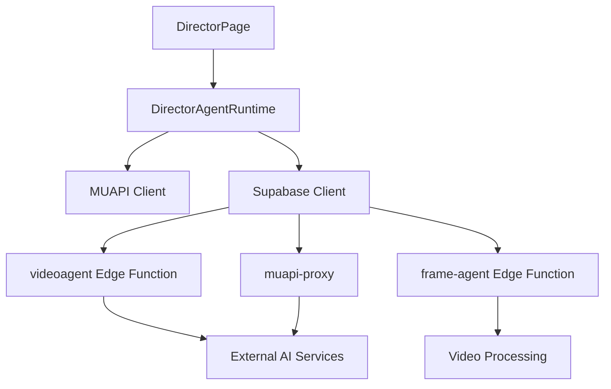

# Backend Integration Plan for Director Page

## Executive Summary

This plan outlines the work required to connect the Director page's frontend features to the backend APIs (MUAPI and Supabase) to make all 24 AI agents and storyboard features fully operational.

---

## Current Architecture Analysis

### Frontend Components

| Component | Location | Status |
|-----------|----------|--------|
| DirectorPage | `src/components/DirectorPage.js` | Implemented with storyboard UI |
| DirectorAgentRuntime | `src/lib/directorAgentRuntime.js` | Implemented with state management |
| MUAPI Client | `src/lib/muapi.js` | Implemented with image/video/audio/text generation |
| Supabase Client | `src/lib/supabase.js` | Implemented with storage |

### Backend Services (Supabase Edge Functions)

| Function | Location | Purpose |
|----------|----------|---------|
| `muapi-proxy` | `supabase/functions/muapi-proxy/` | Proxy for external AI APIs |
| `muapi-webhook` | `supabase/functions/muapi-webhook/` | Webhook for async operations |
| `videoagent` | `supabase/functions/videoagent/` | Video processing pipeline |
| `frame-agent` | `supabase/functions/frame-agent/` | Video editing commands |
| `process-upload` | `supabase/functions/process-upload/` | Upload processing |
| `create-share` | `supabase/functions/create-share/` | Sharing functionality |

---

## Gap Analysis

### 1. Storyboard Frame Generation

**Current State:**
- `directorRuntime.generateFrame()` creates palette colors locally
- No actual image generation connected

**Required Integration:**
- Connect to MUAPI `generateImage()` for actual frame visualization
- Map storyboard presets to appropriate image models

### 2. AI Agent Commands

**Current State:**
- 24 agents defined in `directorAgentRuntime.js`
- Chat commands are simulated (not connected to real APIs)

**Required Integration:**
- Connect each agent to appropriate backend function
- Map agent actions to videoagent edge function

### 3. Quick Actions

**Current State:**
- UI buttons exist with simulated responses

**Required Integration:**
- Connect to `videoagent` edge function
- Map actions to appropriate pipeline steps

---

## Implementation Plan

### Phase 1: Core Backend Connection

#### 1.1 Connect Frame Generation to MUAPI

```javascript
// In directorAgentRuntime.js - update generateFrame method
async generateFrame(frameId) {
  const frame = this.getFrameById(frameId);
  if (!frame) throw new Error(`Frame ${frameId} not found`);
  
  // Build prompt from frame data
  const prompt = buildStoryboardFramePrompt(frame, this.currentPreset, this.projectKnowledge);
  
  // Call MUAPI for image generation
  const muapiClient = new MuapiClient();
  const result = await muapiClient.generateImage({
    prompt: prompt,
    model: this.getModelForPreset(this.currentPreset),
    aspect_ratio: this.currentPreset.aspectRatio,
    studioType: 'storyboard'
  });
  
  // Update frame with generated image URL
  this.updateFrame(frameId, { 
    generated: true, 
    imageUrl: result.url,
    palette: paletteFromText(prompt)
  });
  
  return this.getFrameById(frameId);
}

getModelForPreset(preset) {
  const modelMap = {
    'cinematic-story': 'flux-pro',
    'commercial-ad': 'flux-pro',
    'documentary-flow': 'flux-dev',
    'social-shorts': 'flux-pro'
  };
  return modelMap[preset.id] || 'flux-pro';
}
```

#### 1.2 Create Agent Command Router

```javascript
// In directorAgentRuntime.js - add agent command execution
async executeAgentCommand(agentId, params = {}) {
  const agentCommandMap = {
    'summarizer': { action: 'summarize-video', endpoint: '/video/summarize' },
    'search': { action: 'search-media', endpoint: '/video/search' },
    'clipper': { action: 'create-clip', endpoint: '/video/clip' },
    'dubbing': { action: 'dub-video', endpoint: '/video/dub' },
    'subtitler': { action: 'generate-subtitles', endpoint: '/video/subtitle' },
    'highlighter': { action: 'extract-highlights', endpoint: '/video/highlights' },
    'scenes': { action: 'detect-scenes', endpoint: '/video/scenes' },
    'broll': { action: 'add-broll', endpoint: '/video/broll' },
    'voiceover': { action: 'add-voiceover', endpoint: '/video/voiceover' },
    'editor': { action: 'edit-video', endpoint: '/video/edit' },
    // ... map remaining agents
  };
  
  const command = agentCommandMap[agentId];
  if (!command) throw new Error(`Unknown agent: ${agentId}`);
  
  // Call via supabase function
  const { data, error } = await supabase.functions.invoke('videoagent', {
    body: { ...command, ...params }
  });
  
  if (error) throw error;
  return data;
}
```

### Phase 2: Agent-Specific Integrations

#### 2.1 Video Summarizer Agent

```typescript
// supabase/functions/videoagent/index.ts - add summarize action
case 'summarize-video':
  steps = ['Analyzing video content', 'Extracting keyframes', 'Generating summary', 'Creating overview'];
  // Call MUAPI for analysis
  result = await muapiClient.analyzeVideo({ videoUrl: request.videoUrl });
  break;
```

#### 2.2 Scene Detection Agent

```typescript
case 'detect-scenes':
  steps = ['Scanning video frames', 'Identifying scene boundaries', 'Categorizing scenes', 'Building scene map'];
  // Use frame-agent for scene detection
  break;
```

#### 2.3 Highlight Extractor Agent

```typescript
case 'extract-highlights':
  steps = ['Analyzing video content', 'Scoring moments', 'Extracting highlights', 'Compiling reel'];
  break;
```

### Phase 3: Quick Actions Integration

#### 3.1 Map Quick Actions to Backend

| Action | Backend Function | Parameters |
|--------|-----------------|------------|
| Summarize | videoagent | action: 'summarize-video' |
| Extract Highlights | videoagent | action: 'extract-highlights' |
| Detect Scenes | videoagent | action: 'detect-scenes' |
| Add Subtitles | videoagent | action: 'generate-subtitles' |
| Dub Video | videoagent | action: 'dub-video' |
| Add B-Roll | videoagent | action: 'add-broll' |
| Voiceover | videoagent | action: 'add-voiceover' |
| Create Shorts | videoagent | action: 'create-shorts' |
| Color Correction | videoagent | action: 'color-correct' |
| Stabilize | videoagent | action: 'stabilize' |

### Phase 4: State Persistence

#### 4.1 Save/Load Storyboard to Database

```javascript
// Add persistence methods to directorAgentRuntime
async saveStoryboard(projectId) {
  const { data, error } = await supabase
    .from('storyboards')
    .upsert({
      id: projectId,
      frames: this.frames,
      preset: this.currentPreset,
      updated_at: new Date().toISOString()
    });
  
  if (error) throw error;
  return data;
}

async loadStoryboard(projectId) {
  const { data, error } = await supabase
    .from('storyboards')
    .select('*')
    .eq('id', projectId)
    .single();
  
  if (error) throw error;
  
  this.frames = data.frames;
  this.currentPreset = data.preset;
  this.notifyStateChange();
}
```

---

## Database Schema Requirements

### Existing Tables (from migrations)

- `generations` - Store generation history
- `projects` - Project metadata
- `templates` - Template definitions
- `uploads` - File storage

### Required New Tables

```sql
-- Storyboards table
CREATE TABLE storyboards (
  id UUID PRIMARY KEY DEFAULT gen_random_uuid(),
  user_id UUID REFERENCES auth.users(id),
  name TEXT,
  frames JSONB,
  preset JSONB,
  video_id UUID,
  created_at TIMESTAMPTZ DEFAULT NOW(),
  updated_at TIMESTAMPTZ DEFAULT NOW()
);

-- Agent executions table
CREATE TABLE agent_executions (
  id UUID PRIMARY KEY DEFAULT gen_random_uuid(),
  user_id UUID REFERENCES auth.users(id),
  agent_id TEXT,
  status TEXT,
  input JSONB,
  output JSONB,
  created_at TIMESTAMPTZ DEFAULT NOW()
);
```

---

## API Flow Diagram



---

## Task Breakdown

### Step 1: Update directorAgentRuntime.js
- [ ] Add MuapiClient import
- [ ] Implement getModelForPreset()
- [ ] Update generateFrame() to call MUAPI
- [ ] Add executeAgentCommand()
- [ ] Add saveStoryboard() / loadStoryboard()

### Step 2: Update DirectorPage.js
- [ ] Import MuapiClient
- [ ] Update chat processing to use real API calls
- [ ] Add loading states for agent operations
- [ ] Display results from agents

### Step 3: Extend videoagent Edge Function
- [ ] Add missing action handlers (summarize, scenes, highlights, etc.)
- [ ] Implement video analysis endpoints
- [ ] Add error handling

### Step 4: Create Database Tables
- [ ] Create storyboards table
- [ ] Create agent_executions table
- [ ] Add RLS policies

### Step 5: Testing
- [ ] Test frame generation
- [ ] Test each agent command
- [ ] Test quick actions
- [ ] Test save/load

---

## Next Steps

1. **Approve this plan** - Review and confirm the implementation approach
2. **Begin Phase 1** - Connect frame generation to MUAPI
3. **Continue with Phases 2-4** - Implement agent integrations and persistence

---

## Questions for Clarification

1. Should storyboards be saved per-user or globally?
2. Which specific video models should be used for each agent action?
3. Is there a preferred timeout for agent operations?
4. Should we implement real-time progress updates via WebSocket?
