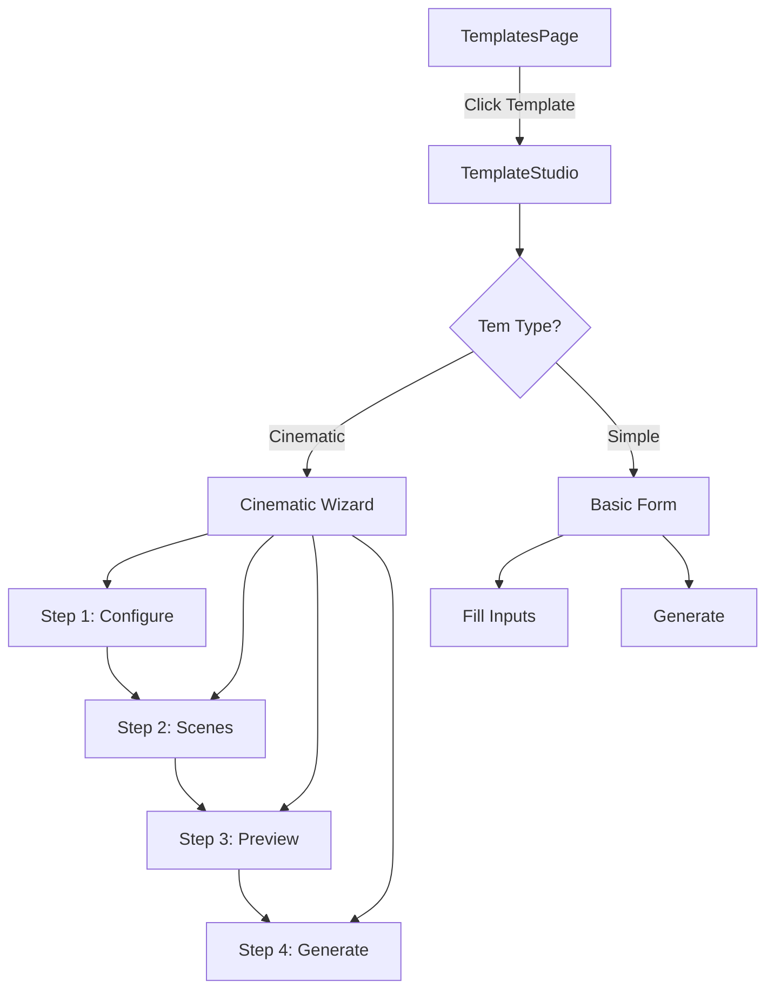

# Cinematic Template Integration Plan

## Overview
Integrate the cinematic template system into the existing `TemplatesPage` and `TemplateStudio` components, adding step-by-step wizard workflows for creating content with each template.

## Current Architecture
```
TemplatesPage.js        → TemplateStudio.js        → Generation
(browse templates)      (simple form + generate)     (muapi call)
```

## Target Architecture
```
TemplatesPage.js        → TemplateStudio.js        → Multi-Step Wizard         → Generation
(browse templates)      (enhanced template)         (cinematic workflow)        (muapi call)
```

## Implementation Steps

### Step 1: Enhance templates.js with Cinematic Metadata
- Add `cinematic` flag to templates that support cinematic workflow
- Add `steps` configuration to each template
- Add `sceneStructure`, `outputStyle`, `visualStyle` mappings
- Add `quickInputs` and `advancedInputs` separation

### Step 2: Create CinematicTemplateWizard Component
- Multi-step wizard UI with progress indicator
- Steps: Configure → Scenes → Preview → Generate
- Support for both Quick Mode and Advanced Mode
- Scene builder integration
- Storyboard viewer

### Step 3: Modify TemplateStudio.js
- Detect if template has cinematic workflow
- If cinematic: render CinematicTemplateWizard
- If not: use existing simple form
- Preserve backward compatibility

### Step 4: Integrate Prompt Assembly Engine
- Wire up PromptAssemblyEngine to generate prompts
- Live prompt preview as user configures
- Brand context injection

### Step 5: Add Template Creator/Editor
- Allow users to create custom templates
- Step-by-step template creation wizard
- Set inputs, categories, outputs, workflows
- Save custom templates to localStorage

## Mermaid Diagram: Template Creation Flow



## Files to Modify
1. `src/lib/templates.js` - Add cinematic metadata to templates
2. `src/components/TemplateStudio.js` - Add wizard detection and routing
3. `src/components/CinematicTemplateWizard.js` - New multi-step wizard component

## New Component: CinematicTemplateWizard

### Steps:
1. **Configure** - Basic inputs (quick or advanced)
2. **Scenes** - Scene builder (if enabled)
3. **Preview** - Generated prompt preview, storyboard
4. **Generate** - Output generation with progress

### Features:
- Progress bar showing current step
- Back/Next navigation
- Form validation per step
- Live preview updates
- Scene/Shot building interface
- Storyboard visualization

## Template Schema Enhancement

```javascript
// In templates.js, each template gains:
{
  id: 'cinematic_short_film',
  // ... existing fields ...
  
  // NEW: Cinematic workflow support
  cinematic: true,
  workflowSteps: ['configure', 'scenes', 'preview', 'generate'],
  
  // Step configurations
  steps: {
    configure: {
      quickInputs: [...],
      advancedInputs: [...],
      brandContext: true
    },
    scenes: {
      enabled: true,
      structure: SCENE_STRUCTURES.THREE_ACT,
      autoGenerate: true
    },
    preview: {
      showStoryboard: true,
      showPrompt: true
    }
  },
  
  // Output settings
  outputStyle: OUTPUT_STYLES.CINEMATIC_COMMERCIAL,
  visualStyle: VISUAL_STYLES.DRAMATIC_CINEMATIC,
  
  // CTA support
  includeCTA: true,
  ctaOptions: ['shop_now', 'learn_more']
}
```
