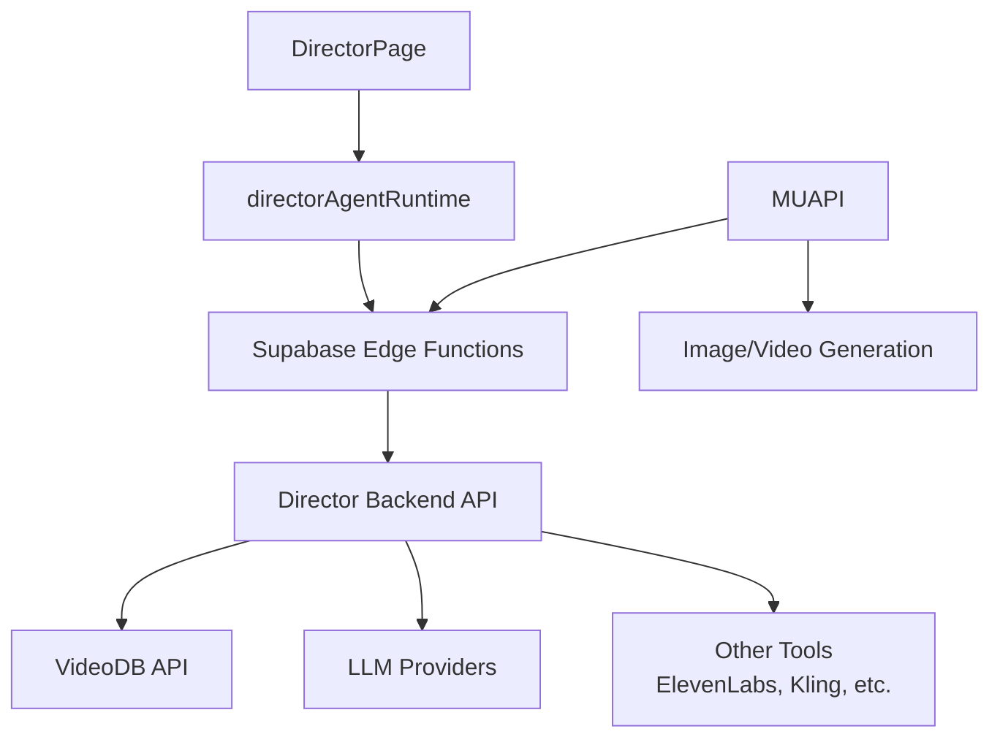

# Director Repo Integration Plan

## Executive Summary

This plan outlines how to integrate the [deangilmoreremix/Director](https://github.com/deangilmoreremix/Director) repository into the Higgsfield application to enable full agentic video operations. The Director repo provides AI video agents with reasoning capabilities, video search, scene detection, highlight extraction, and more - powered by VideoDB.

---

## Current Architecture

### What Director Provides

The Director repo (`apps/director/`) contains:

**Backend (Python/FastAPI):**
- **25+ Specialized Agents:**
  - `SummarizeVideoAgent` - Generate video summaries
  - `SearchAgent` - Search within video content
  - `SubtitleAgent` - Generate subtitles
  - `DubbingAgent` - Video dubbing/translation
  - `VideoGenerationAgent` - Generate videos
  - `ImageGenerationAgent` - Generate images
  - `AudioGenerationAgent` - Generate audio
  - `CloneVoiceAgent` - Clone voices
  - `VoiceReplacementAgent` - Replace video voices
  - `EditingAgent` - Video editing
  - `TextToMovieAgent` - Text to movie generation
  - `StreamVideoAgent` - Video streaming
  - `CensorAgent` - Content censorship
  - `PromptClipAgent` - Prompt-based clipping
  - `IndexAgent` - Video indexing
  - And more...

- **Reasoning Engine** (`director/core/reasoning.py`):
  - Multi-agent orchestration
  - Intelligent agent routing based on user input

- **VideoDB Integration** (`director/tools/videodb_tool.py`):
  - Scene detection
  - Video search
  - Highlight extraction
  - Video indexing
  - Collection management

- **LLM Support**:
  - Anthropic (Claude)
  - Google AI (Gemini)
  - OpenAI (GPT-4)

---

## Required API Keys

To make Director work 100%, you need:

1. **VideoDB API Key** (REQUIRED)
   - Get from: https://videodb.io/
   - Used for: Scene detection, video search, highlights, transcription
   - Environment: `VIDEO_DB_API_KEY`

2. **LLM API Keys** (At least one required):
   - `ANTHROPIC_API_KEY` - For Claude
   - `OPENAI_API_KEY` - For GPT-4
   - `GOOGLE_API_KEY` - For Gemini

---

## Integration Architecture



---

## Implementation Plan

### Phase 1: Environment Setup

- [ ] Add VideoDB API key to environment variables
- [ ] Add LLM API keys (Anthropic/OpenAI/Google)
- [ ] Configure database (SQLite or PostgreSQL)

### Phase 2: Deploy Director Backend

**Option A: Deploy as separate service**
```bash
cd apps/director/backend
pip install -r requirements.txt
cp .env.sample .env
# Edit .env with your API keys
python -m director.entrypoint.api.server
```

**Option B: Integrate into existing Supabase Edge Functions**
- Convert Python agents to TypeScript
- Or use Python edge functions

### Phase 3: Connect Frontend to Director

**Option A: Direct API calls**
```javascript
// In directorAgentRuntime.js
async executeAgentCommand(agentId, params) {
  const response = await fetch('DIRECTOR_API_URL/chat', {
    method: 'POST',
    body: JSON.stringify({
      message: params.prompt,
      agents: [agentId],
      collection_id: params.collectionId,
      video_id: params.videoId
    })
  });
}
```

**Option B: Via Supabase Edge Functions**
- Create edge function that proxies to Director backend

### Phase 4: VideoDB Integration

The Director backend already has VideoDB integrated. You need:
1. VideoDB API key
2. Create a collection in VideoDB
3. Upload videos to VideoDB

---

## Quick Start (If you have VideoDB key)

### 1. Setup Director Backend

```bash
cd apps/director/backend

# Create virtual environment
python -m venv venv
source venv/bin/activate  # or venv\Scripts\activate on Windows

# Install dependencies
pip install -r requirements.txt

# Copy environment file
cp .env.sample .env

# Edit .env with your keys:
# VIDEO_DB_API_KEY=your_videodb_key
# ANTHROPIC_API_KEY=your_anthropic_key
# (or OPENAI_API_KEY or GOOGLE_API_KEY)

# Run the server
python -m director.entrypoint.api.server
```

### 2. Test the API

```bash
# Check health
curl http://localhost:8000/health

# Get available agents
curl http://localhost:8000/agents
```

### 3. Connect Frontend

Update `directorAgentRuntime.js` to call the Director API instead of Supabase functions.

---

## Alternative: Use VideoDB Directly

If you don't want to deploy the full Director backend, you can use VideoDB directly:

1. Get VideoDB API key
2. Use VideoDB SDK in frontend or create edge functions
3. Implement agents that call VideoDB endpoints

VideoDB provides:
- `search()` - Search within videos
- `get_scenes()` - Scene detection
- `get_highlights()` - Highlight extraction
- `generate_subtitles()` - Subtitle generation
- `transcribe()` - Audio transcription

---

## Key Files to Modify

| File | Purpose |
|------|---------|
| `src/lib/directorAgentRuntime.js` | Connect to Director backend API |
| `src/components/DirectorPage.js` | Update to use Director agents |
| `.env` | Add VideoDB and LLM API keys |
| `supabase/functions/director-proxy/` | Optional: Proxy to Director backend |

---

## Summary

To make Director work 100%, you need:

1. **VideoDB API Key** ( REQUIRED - this is the main dependency)
2. **At least one LLM API key** (Anthropic, OpenAI, or Google)
3. **Deploy Director backend** (or use VideoDB directly)

The Director repo provides a complete agentic video orchestration system. Once you have the VideoDB key and deploy the backend, the 24+ AI agents will be fully operational.

**Next Step:** Provide your VideoDB API key and we can proceed with the integration.
